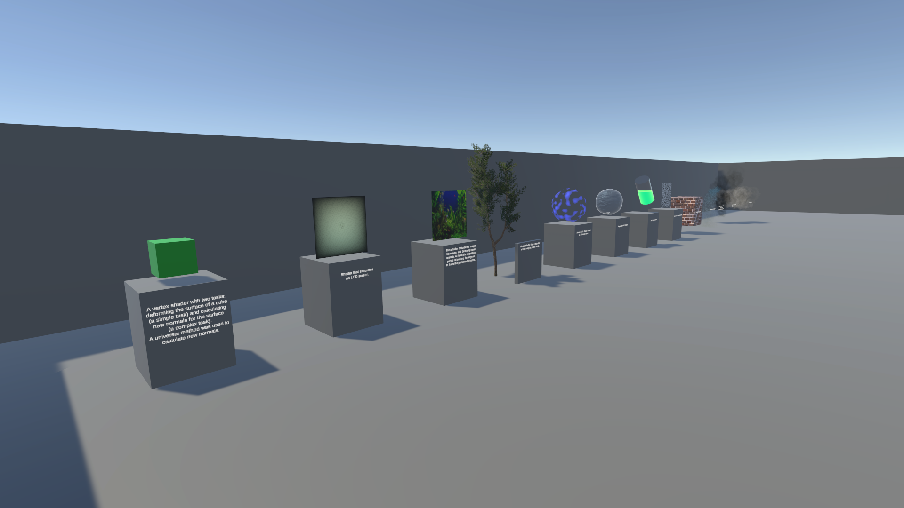
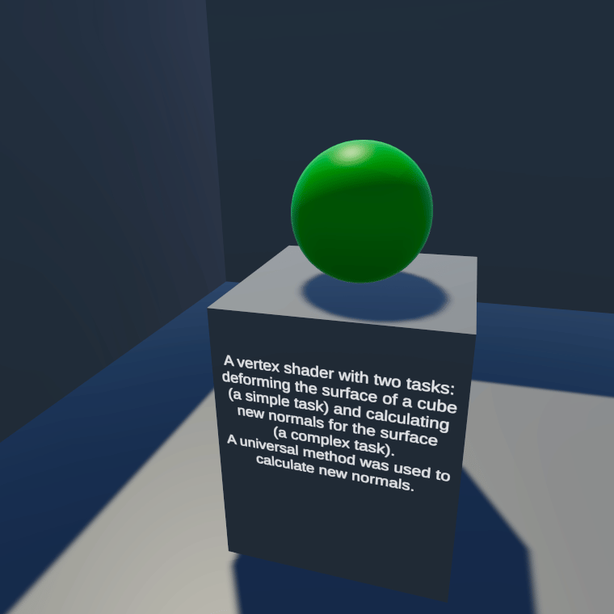
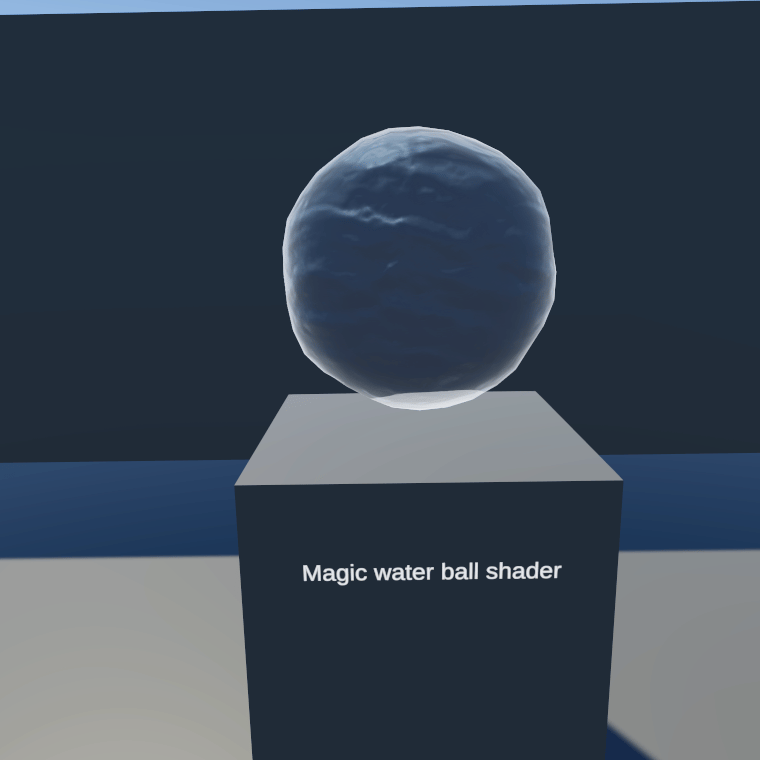
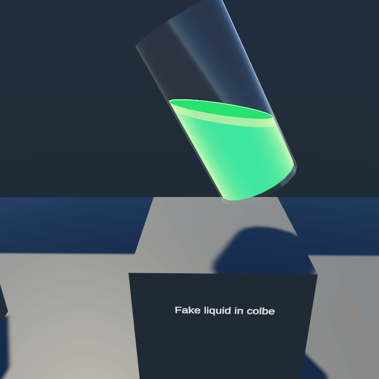

# VFX and Shader Artist Portfolio

## Overview

Welcome to my GitHub repository, which serves as a portfolio showcasing my work as a Visual Effects (VFX) and Shader (Technical) Artist. This project demonstrates my skills and creativity in the realm of computer graphics, specializing in creating stunning visual effects and shaders for games and interactive media.

This project also contains custom particle system, which also available solely in their own [repository](https://github.com/5a5ha111/CustomVFX) . Also check [NoesisRender](https://github.com/5a5ha111/NoesisRender), Render Pipeline written by me.

[Walkthrough](https://youtu.be/dANNDLbDnuM)

  

## Table of Contents

1. [Introduction](#introduction)
2. [Technologies](#technologies)
3. [Usage](#usage)
4. [License](#license)
5. [Contact](#contact)

## Introduction

As a passionate VFX and Shader Artist, I strive to push the boundaries of visual storytelling through the power of computer-generated imagery. In this portfolio you can find a demonstration of the use of various shader and visual effects techniques.

## Most Noticeable shaders

 
A vertex shader with two tasks: deforming the surface of a cube (a simple task) and calculating new normals for the surface (a complex task). 
A universal method was used to calculate new normals.

---

 
Magic water ball shader

---

 
Fake Liquid in colbe

---

The shader creates the illusion that there are rooms inside this building. It's much cheaper (both in effort and performance) than creating actual spaces inside each home.

---

## Technologies

- Unity Editor itself
- C# language for some effects and custom inspector for other developers.
- Shader Graph for creating most of the shaders.
- Visual Effect Graph for creating, you guessed it right, visual effects
- HLSL for writing shaders that cannot be created in the shader graph.

## Usage

Open this project using Unity 2022.3.10f1 and feel free to explore. Main scene placed /Assets/AlexandraPortfolio/Exposition.unity 

## License

This portfolio is licensed under the [MIT License](LICENSE).

## Contact

- **Email:** [5a5ha0rr1ove@gmail.com](mailto:5a5ha0rr1ove@gmail.com)
- **LinkedIn:** [LinkedIn Profile](https://www.linkedin.com/in/sasha-orlova-abb960273/)

Feel free to reach out if you have any questions, collaboration opportunities, or just want to connect.
